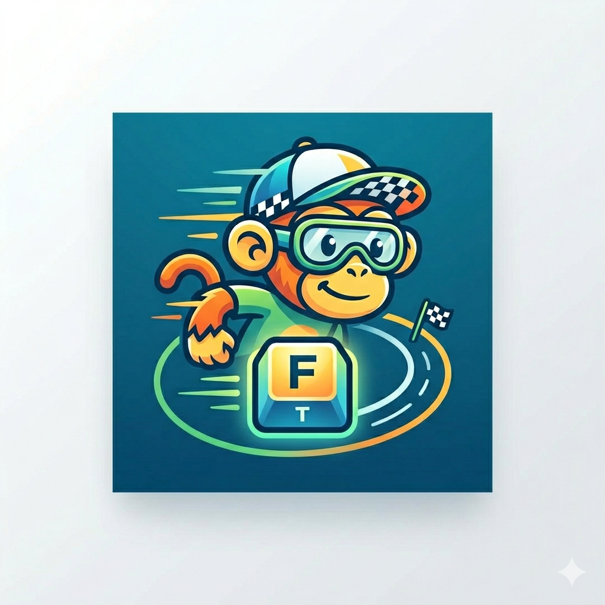
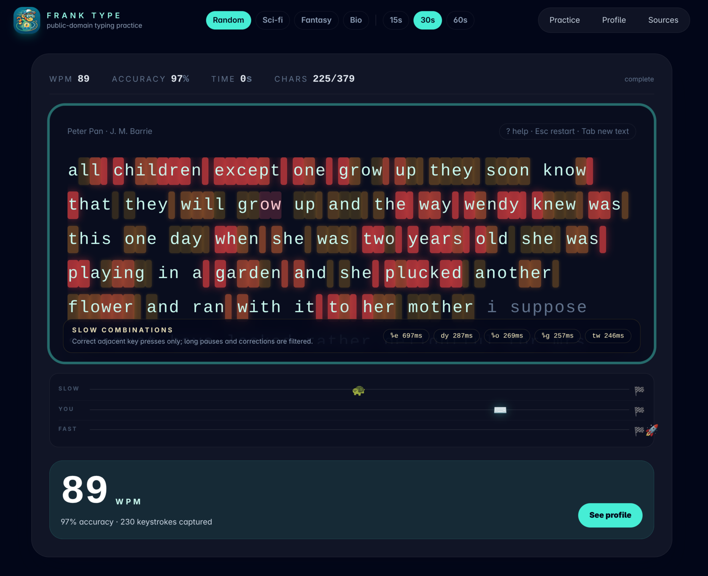
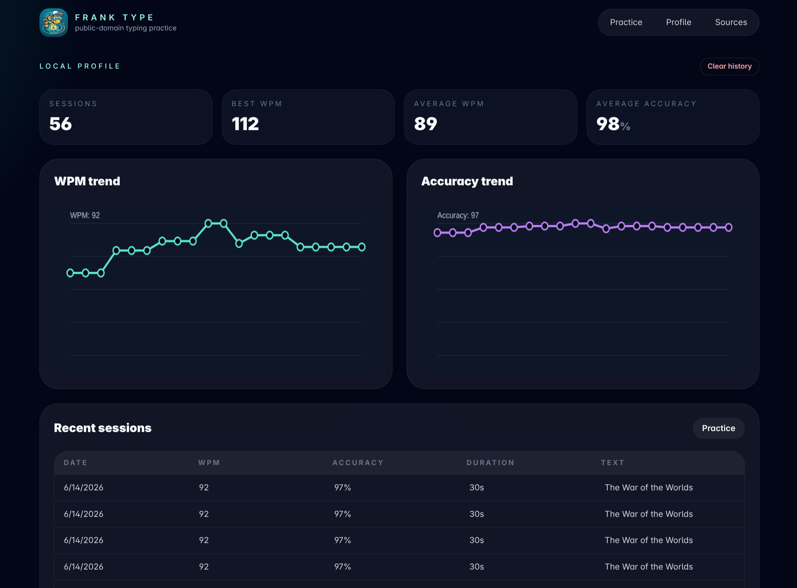
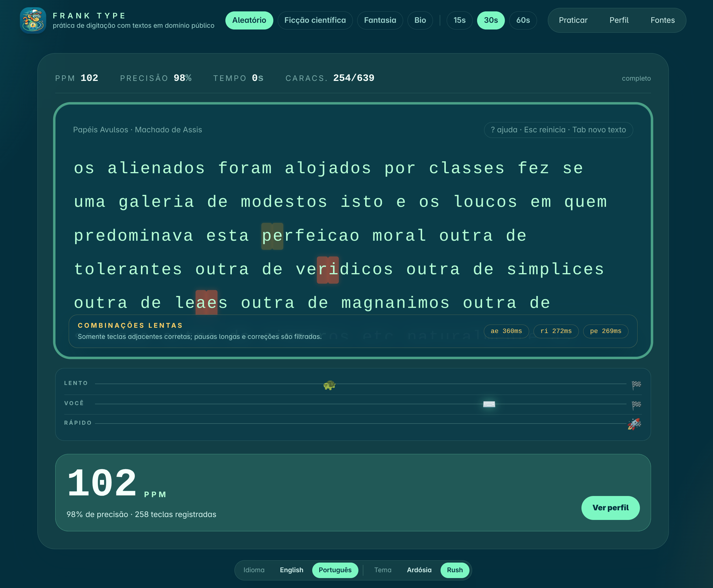

<p align="center">
  
</p>

# Frank Type

Frank Type is a Rails 8 typing trainer for practicing on normalized public-domain prose instead of random word lists. It is built for local-first, no-account use: session history, timing data, and profile charts stay in the browser's local storage.

<p align="center">
  
  
</p>

## Run with Docker

Docker is the easiest way to run Frank Type. The image is published as `akitaonrails/frank_type` and runs Rails through Thruster on container port `80`.

### Option 1: run the published image

Fast launcher from GitHub:

```bash
curl -fsSL https://raw.githubusercontent.com/akitaonrails/frank_type/master/bin/docker-run.sh | bash
```

It defaults to <http://localhost:3200>. Override values when needed:

```bash
curl -fsSL https://raw.githubusercontent.com/akitaonrails/frank_type/master/bin/docker-run.sh | PORT=8080 HOST=localhost bash
```

Manual equivalent:

```bash
docker run --rm \
  -p 3200:80 \
  -e RAILS_ENV=production \
  -e SECRET_KEY_BASE=development-only-secret-key-base-change-me-development-only-secret-key-base \
  -e HOST=localhost \
  -e FORCE_SSL=false \
  -e ASSUME_SSL=false \
  akitaonrails/frank_type:latest
```

Open <http://localhost:3200>.

### Option 2: run from this repository

```bash
docker compose up --build
```

Open <http://localhost:3200>.

### Production Docker Compose

1. Copy `docker-compose.prod.yml` and a real `.env.production` to the server.
2. Put a TLS reverse proxy in front of `127.0.0.1:3200`.
3. Run:

```bash
docker compose -f docker-compose.prod.yml pull
docker compose -f docker-compose.prod.yml up -d
```

Production env template:

```bash
cp .env.production.example .env.production
bin/rails secret # use this value for SECRET_KEY_BASE
```

For a real public deployment, keep `FORCE_SSL=true`, `ASSUME_SSL=true`, and set `HOST` to the public host name served by your reverse proxy.

### Build and publish to Docker Hub

Manual publish requires `docker login` and Buildx:

```bash
bin/docker-publish
```

Defaults:

- image: `akitaonrails/frank_type`
- tags: `latest` and the current git short SHA
- platforms: `linux/amd64,linux/arm64`

Override when needed:

```bash
IMAGE=yourname/frank_type VERSION_TAG=v1.0.0 PLATFORMS=linux/amd64 bin/docker-publish
```

GitHub Actions also publishes on pushes to `master`, tags matching `v*`, and manual workflow dispatch. Configure repository secrets `DOCKERHUB_USERNAME` and `DOCKERHUB_TOKEN`.

## Highlights

- Rails-rendered UI with Hotwire, Stimulus, Importmap, and Tailwind CSS.
- Public-domain corpus organized for multiple languages: `config/excerpts/<language>/<category>/<speed>.yml`.
- English and Brazilian Portuguese corpus categories: `scifi`, `fantasy`, and `biography`.
- Brazilian Portuguese practice preserves accents/diacritics and is intended to train US-layout dead keys, Option accents, and other composed accent entry.
- Locale-aware UI and corpus loading; normal requests load only the selected language.
- Theme switcher with a preserved Slate theme and a logo-derived Rush palette.
- Adaptive excerpt choice based on recent local WPM:
  - `slow`: sub-60 WPM
  - `medium`: roughly 75–139 WPM
  - `fast`: 140+ WPM
- Category toggle with random fallback.
- Timed sessions: 15s, 30s, and 60s.
- Accurate browser-side key timing via `performance.now()`.
- Per-session metrics: WPM, raw WPM, accuracy, mistakes, character timings, word timings, key events, and digraph timings.
- Post-run digraph heat map: slow adjacent character pairs are highlighted after the timer ends.
- Typeracer-style race strip with simulated slower/faster competitors.
- Local profile page with WPM and accuracy trends; older detailed runs compact into daily summaries to keep browser storage bounded.
- Docker-first local run, Docker Hub publishing, and production Compose deployment.

## Electron desktop (Windows, experimental)

A self-contained Windows installer is produced from the same Rails app, embedding the Ruby runtime, precompiled assets, and an Electron shell. The Rails process listens on a free local port and the renderer connects to it through a `contextIsolated` `BrowserWindow`.

> **Status:** this PR is Windows-only and is shipping as a working but experimental build. macOS and Linux packaging are not yet implemented; the corresponding `npm run` scripts exist but exit with a clear "not yet implemented" message.

### Prerequisites

- Node.js 20+ and npm (the project's own `package-lock.json` pins the exact versions of `electron` and `electron-builder`).
- Ruby 3.4.8 (matching `.ruby-version`) on `PATH` for the build-time asset precompile. The packed app does not require a system Ruby; the bundled runtime is downloaded as part of the build.
- 7-Zip on `PATH` for the Ruby download/extract step (`p7zip-full` on Debian/Ubuntu, 7-Zip on Windows).

### Commands

```bash
npm ci                                    # reproducible install
npm run assets:precompile                 # one-off, or rely on build:win to do it
npm run electron:dev                      # run from source against dev Ruby
npm run electron                          # run from source against production env
npm run build:win                         # download Ruby, precompile assets, build NSIS installer
npm run build:ruby:win                    # only download/extract the Windows Ruby
npm run smoke:test                        # documented packaging smoke test
```

The smoke test (`scripts/smoke-test.mjs`) is also picked up by `npm test` and verifies the build configuration, runtime contract, and post-build artifacts without needing a real Electron launch.

### How a packaged build is laid out

- `asar: false`. Rails spawns subprocesses and reads the app tree directly, so the install is unpacked on disk.
- `extraResources` ships the Ruby runtime next to the app, leaving the original `ruby/` source folder out of the bundled output.
- Assets are precompiled at build time. The runtime never invokes `assets:precompile` or `tailwindcss:build`.
- A per-installation `SECRET_KEY_BASE` is generated on first launch and stored under `app.getPath('userData')`. This is enough for Rails' `production.rb` defaults and is the only place persistent secret state lives; it never travels with the installer.
- `HOST=127.0.0.1`, `FORCE_SSL=false`, `ASSUME_SSL=false` are forced at launch so the bundled Rails app talks plain HTTP to the local `BrowserWindow`.

### Verifying a built desktop app

1. `npm run build:win` produces a single NSIS installer under `dist/`.
2. Run the installer on a clean Windows VM (no Ruby, no Node).
3. Launch Frank Type from the Start menu shortcut.
4. Confirm the typing surface renders and the `/up` health check answers (visible in the Windows console window if launched from a terminal).
5. `npm run smoke:test` re-checks the contract for the build artifacts and is safe to run from CI.

### Known limitations

- Only `win32/x64` is targeted. `npm run build:mac`, `npm run build:linux`, and `npm run dist:all` exist as stubs that exit with an explanatory message.
- The installer is **not code-signed** and is **not notarized**. Windows SmartScreen and any macOS Gatekeeper equivalent will warn or block the binary; the README does not promise a clean first-launch experience.
- The downloaded Ruby archive is verified against a pinned SHA256 constant; update that constant when changing RubyInstaller versions.
- `BUNDLE_PATH` is the bundled runtime's `vendor/bundle` on first launch; this is intended for an offline install and is not a multi-user install path.

## Keyboard controls

| Key | Action |
| --- | --- |
| `?` | Open shortcut help |
| `Esc` | Restart current run; closes help if help is open |
| `Tab` | Load a random compatible excerpt |

## Development without Docker

```bash
bin/setup
bin/dev
```

Open <http://localhost:3000>.

## Tests

```bash
bin/rails test
npm test
bin/rails tailwindcss:build
```

`bin/ci` also runs RuboCop, Brakeman, bundler-audit, importmap audit, and SimpleCov-backed Rails tests.

## Corpus notes

Project Gutenberg is the canonical source. Do not scrape its human-facing pages. Future importers should use official feeds, robot harvest URLs, rsync mirrors, or Gutendex metadata, then store title, author, ebook id, source URL, copyright flag, and attribution with every excerpt.

Current English excerpts include public-domain Asimov stories available on Gutenberg plus AI/automation-adjacent classics such as _R.U.R._, _Metropolis_, and _The Machine Stops_. Famous Asimov works such as _Foundation_ and _I, Robot_ are not public-domain Gutenberg texts.

Current Brazilian Portuguese excerpts use public-domain Gutenberg texts from Machado de Assis, José de Alencar, Joaquim Nabuco, Visconde de Taunay, and Coelho Netto. Excerpts may modernize obsolete spellings for contemporary typing practice while preserving attribution to the source text.

Target corpus size is at least 10 vetted excerpts per language/category/speed band.

## Contributing locales and themes

<p align="center">
  
</p>

### Locales

- Add UI strings under `config/locales/<locale>.yml`.
- Add excerpts under `config/excerpts/<locale>/<category>/<speed>.yml`.
- Keep the current category/speed structure unless the app UI and tests are updated too.
- Cite public-domain source metadata for every excerpt.
- Locale selection order is query parameter, cookie, browser `Accept-Language`, then English fallback.

### Themes

- Theme tokens live in `app/assets/tailwind/application.css` as CSS variables keyed by `data-theme` on `<html>`.
- Add new theme choices in `app/views/layouts/application.html.erb` and translations under `app.theme`.
- Keep body text contrast at WCAG AA levels (`4.5:1` for normal text). Accent, focus, border, chart, and heat-map colors should be defined through variables, not hard-coded in views or JavaScript.
- Theme preference is stored locally in the browser as `frankType.theme`; no server-side user storage exists.
- Typing history is also browser-local. Recent sessions keep detailed timing data; older sessions are compacted into weighted daily summaries for graphs.

## License

Frank Type is released under the [MIT License](LICENSE).
